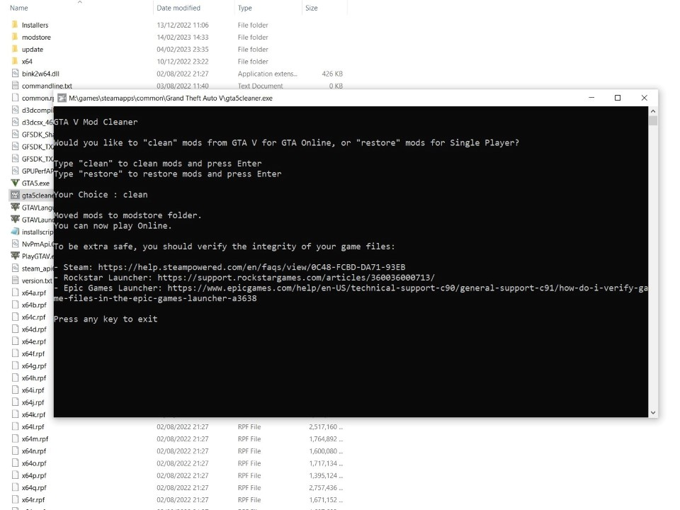

# GTA 5 Cleaner
A tool to clean out mods from Grand Theft Auto 5 for online play, and restore them later.

- [Download](#download)
- [Usage](#usage)
- [Building](#building)
  - [Source Code](#source-code)
  - [Running on Node](#running-on-node)
  - [Compiling a Windows Executable](#compiling-a-windows-executable)
    - [Installing the correct version of nexe](#installing-the-correct-version-of-nexe)
    - [Compiling the exe](#compiling-the-exe)
- [Credits](#credits)

## Download

Get the latest version from the [Releases](https://github.com/ganeshh123/gta5-cleaner/releases/latest) page.

[Download for Windows](https://github.com/ganeshh123/gta5-cleaner/releases/download/1.2.0/gta5cleaner_1.2.0.zip)

## Usage
1. Download and extract `gta5cleaner.exe` to the root 'Grand Theft Auto V' folder (same place as `GTAV.exe`)

2. Double Click and run `gta5cleaner.exe`

3. Enter your choice. Either `clean` or `restore`

  `clean` : Cleans your GTA 5 Installation of mods leaving you with the Base Game for Online Play
  
  `restore` : Restores cleaned mods for Single Player

  
  
4. Once the process is completed, press any key to exit the tool and open the game normally

5. If you use OpenIV or for extra safety, you should verify the integrity of your game files:
    - Steam: [https://help.steampowered.com/en/faqs/view/0C48-FCBD-DA71-93EB](https://help.steampowered.com/en/faqs/view/0C48-FCBD-DA71-93EB)
    - Rockstar Launcher: [https://support.rockstargames.com/articles/360036000713/](https://support.rockstargames.com/articles/360036000713/)
    - Epic Games Launcher: [https://www.epicgames.com/help/en-US/technical-support-c90/general-support-c91/how-do-i-verify-game-files-in-the-epic-games-launcher-a3638](https://www.epicgames.com/help/en-US/technical-support-c90/general-support-c91/how-do-i-verify-game-files-in-the-epic-games-launcher-a3638)

## Building

### Source Code
Git Repository: [https://github.com/ganeshh123/gta5-cleaner](https://github.com/ganeshh123/gta5-cleaner)

### Running on Node
1. Clone/Download the project and copy app.js and essentialFiles.js into the GTA 5 Installation root directory.

2. Open Command Prompt inside the GTA V Installation root directory and run ```node app.js```


### Compiling a Windows Executable
Executables are compiled with a very [specific version of nexe](https://github.com/cspotcode/nexe/tree/fix-vfs) that allows access to the filesystem, which has a tricky setup procedure.

#### Installing the correct version of nexe
Run **install_nexe_win.bat** as admin on **Windows**, will take about 5 minutes to install fully.

Alternatively, install manually like this:

1. Firstly, install the general [nexe](https://www.npmjs.com/package/nexe) globally with the command:

    ```bash
    npm install -g nexe
    ```
2. In the project root folder build some executables with this version of nexe to download node binaries for Windows:

    ```bash
    nexe . --target win32-x86-10.13.0
    ```

    This will download the binaries we need for later, delete the executables built with this for now.

3. Now we need to install a [specific version of nexe](https://github.com/cspotcode/nexe/tree/fix-vfs) that allows access to the filesystem:

    Run the command:

    ```bash
    npm install -g cspotcode/nexe#19a5046
    ```

Now we should have the correct version of nexe for building.

Confirm by running:

```bash
nexe -v
```
Check that the version is `4.0.0-beta.4`

#### Compiling the exe
Run **build_win32.bat** on **Windows** to build a Windows Executable. This can be found in /dist.

To Compile Manually

To build a Windows Executable, run the command:
```bash
nexe . --target win32-x86-10.13.0 -o ./dist/gta5cleaner.exe
```
in the root directory of the project.

## Credits
Icons made by <a href="https://www.flaticon.com/authors/freepik" title="Freepik">Freepik</a> from <a href="https://www.flaticon.com/" title="Flaticon"> www.flaticon.com</a>
